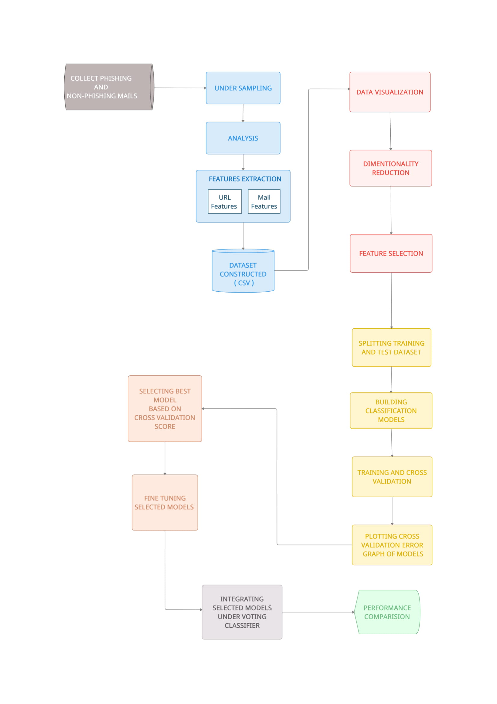

# Identify-Phishing-Mail

This reasearch project aims to conduct a comparative assessment between various classification algorithms techniques, and various features. Moreover, the goal includes the development of multi-classifier integration model by combining more than one classification technique to enhance detection and protecting against phishing emails.

## Objective

The objectives of this research are as follows:

- Determine and evaluate the best set of features to be used for phishing Emails detection using Manual feature selection based on the email structure.
- To determine the best classification algorithm for phishing detection.
- To fine tune the classification algorithm for best performance.
- Design a system which integrate multiple classification algorithms for phishing emails detection and to evaluate such integration.

## Scope and Limitation

The scope of this research is phishing emails detection, where features are extracted from the mails. Moreover, Naive Bayes, Random Forest, Logistic Regression and other top classification ML algorithms were used for phishing emails detection. This research also target to develop an integration of best performing classifier for better prediction.

For the limitation, this research will not cover the phishing websites, moreover the experiments will not cover all the available classification algorithms. However, this study will evaluate experimentally the most well-known algorithms.

## Workflow

